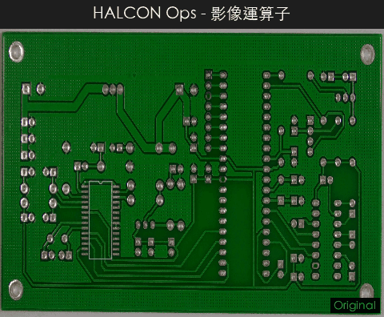

# CV Defect Detection System

<p align="center">
  <strong>整合式工業瑕疵檢測系統</strong><br>
  深度學習 (Autoencoder / PatchCore) + 統計變異模型 (Welford) + 50 種影像運算子<br>
  REST API + SPC 即時警報 + 專案管理 + 多語系<br>
  <sub>Python 3.10+ &nbsp;|&nbsp; 100+ 模組 &nbsp;|&nbsp; 29 測試檔 &nbsp;|&nbsp; 57 項整合驗證通過</sub>
</p>

<p align="center">
  
</p>

---

## 目錄

- [演算法展示](#演算法展示)
- [介面操作](#介面操作)
- [REST API](#rest-api)
- [系統架構](#系統架構)
- [功能總覽](#功能總覽)
- [安裝與啟動](#安裝與啟動)
- [組態設定](#組態設定)
- [測試](#測試)
- [編譯執行檔](#編譯執行檔)

---

## 演算法展示

> 以 PCB（印刷電路板）瑕疵影像即時展示各檢測管線的處理過程與結果。

### 深度學習檢測

<table>
<tr>
<td align="center" width="50%">

**自編碼器異常檢測 (Autoencoder)**

卷積自編碼器重建誤差 + MSE/SSIM 混合評分


原圖 → 重建 → 誤差熱力圖 → 瑕疵疊加

</td>
<td align="center" width="50%">

**PatchCore 記憶庫檢測**

預訓練 CNN 特徵 + ball-tree kNN 異常評分


特徵提取 → 記憶庫匹配 → 異常熱力圖

</td>
</tr>
</table>

### 統計變異模型 (Variation Model)

<p align="center">
  
</p>

| 步驟 | 說明 |
|------|------|
| 訓練 | 逐張餵入良品影像，Welford 線上演算法更新 mean / M2（float64 數值穩定） |
| 建模 | `upper = mean + max(abs_thresh, var_thresh × std)` |
| 檢測 | 比對測試影像 → 過亮/過暗遮罩 → 形態學清理 → 連通區域擷取 |
| 多尺度 | 高斯金字塔多層偵測，同時捕捉大範圍與微小瑕疵 |

### 傳統電腦視覺方法

<table>
<tr>
<td align="center" width="50%">

**邊緣檢測 (Edge Detection)**

Canny / Sobel 梯度邊緣提取


</td>
<td align="center" width="50%">

**連通區域分析 (Blob Analysis)**

Otsu 閾值分割 + 連通元件標記


</td>
</tr>
<tr>
<td align="center">

**形態學運算 (Morphology)**

侵蝕 / 膨脹 / 開運算 / 閉運算


</td>
<td align="center">

**FFT 頻域分析 (Frequency Domain)**

頻譜視覺化 + 高斯高/低通濾波


</td>
</tr>
<tr>
<td align="center">

**色彩檢測 (Color Inspection)**

CIE Lab Delta-E 色差圖 + K-means 調色板


</td>
<td align="center">

**形狀匹配 (Shape Matching)**

梯度方向餘弦相似度 + 金字塔搜尋


</td>
</tr>
</table>

### 工業檢測工具

<table>
<tr>
<td align="center" width="50%">

**次像素量測 (Metrology)**

1D 量測矩形 + 次像素邊緣偵測 + 尺寸計算


</td>
<td align="center" width="50%">

**影像運算子 (50+ 種)**

濾波 / 形態學 / 紋理 / 色彩 / 幾何操作



</td>
</tr>
<tr>
<td align="center">

**條碼 / QR Code 偵測**

ISO 15416/15415 條碼分級 + QR/DataMatrix 解碼


</td>
<td align="center">

**影像拼接 (Stitching)**

特徵點匹配 + RANSAC 單應性 + 多圖拼接


</td>
</tr>
</table>

<details>
<summary><b>重新生成 Demo GIF</b></summary>

```bash
conda activate cv-detect
python generate_demo_gifs.py
```

GIF 輸出至 `assets/demo/`，使用 PCB Defect Dataset v3 (CC BY 4.0) 的影像。
</details>

---

## 介面操作

### 主畫面佈局

```
┌─────────────────────────────────────────────────────────────────┐
│  [DL ▸▸▸] [VM ▸▸▸] [工具 ▸▸] [量測 ▸] [顯示 ▸]    ← 工具列    │
├────────┬──────────────────────────────┬──────────────────────────┤
│ 管線面板 │      影像檢視器               │ OK/NG 判定指示器         │
│        │                              ├──────────────────────────┤
│ ┌────┐ │  ┌──────────────────────┐    │ 影像屬性 (尺寸/直方圖)    │
│ │ 01 │ │  │                      │    ├──────────────────────────┤
│ │原圖│ │  │    可縮放、可平移      │    │[操作][即時][SPC][結果]    │
│ ├────┤ │  │    像素追蹤           │    │[快捷][歷史]              │
│ │ 02 │ │  │    區域選取           │    │                          │
│ │灰階│ │  │    右鍵快捷選單       │    │  操作: DL 參數 slider ×4  │
│ ├────┤ │  │                      │    │       VM 參數 slider ×7  │
│ │ 03 │ │  │                      │    │       Canny 參數 ×2      │
│ │邊緣│ │  └──────────────────────┘    │       影像處理按鈕 ×5    │
│ └────┘ │                              │                          │
├────────┴──────────────────────────────┴──────────────────────────┤
│  就緒  │ 位置: (x, y) │ 像素值: [R,G,B] │ 100% │ 🖥 MPS │ 3/5  │
└─────────────────────────────────────────────────────────────────┘
```

### 工具列按鈕分組

| 群組 | 按鈕 | 說明 |
|------|------|------|
| **檔案** | 📂 💾 ↩ ↪ | 開啟 / 儲存 / 復原 / 重做 |
| **檢視** | ⊞ 🔍+ 🔍- 1:1 | 適配 / 放大 / 縮小 / 原尺寸 |
| **DL** | 🎯 📦 🔍 📋 | DL 訓練 / 載入 / 檢測 / 批次 |
| **VM** | 📊 📁 🔎 | VM 訓練 / 載入 / 檢測 |
| **工具** | ◈ ▧ ▩ ☰ ↔ | 像素檢查 / 閾值 / Blob / 腳本 / 比對 |
| **量測** | ⌖ ▭ | 像素檢查工具 / 區域選取工具 |
| **顯示** | ▦ + | 網格 / 十字線 |

### 右側面板分頁

| 分頁 | 功能 | 操作內容 |
|------|------|---------|
| **操作** | 參數調整 | DL: 閾值百分位 (80-99.9%)、SSIM 權重 (0-1)、平滑 Sigma (0.5-10)、最小面積<br>VM: 絕對閾值 (0-100)、變異倍數 σ (0.5-10)、模糊核 (1-15)、形態核 (1-15)、多尺度開關、金字塔層數<br>邊緣: Canny Low/High (0-255)<br>影像處理: 灰階 / 模糊 / 邊緣 / 直方圖均衡 / 反色 |
| **即時檢測** | 連續檢測 | 來源選擇（目錄監控 / 相機）、啟動/停止、間隔設定、即時統計 |
| **SPC** | 統計儀表板 | 良率趨勢、Cp/Cpk 指標、管制圖、異常計數 |
| **結果** | 檢測結果 | PASS/NG 指示燈、統計摘要（總數/良率/均分）、結果表格、CSV/PDF 匯出 |
| **快捷** | 一鍵操作 | DL 工作流 (5 按鈕)、VM 工作流 (5 按鈕)、影像處理 (5 按鈕)、進階工具 (5 按鈕)、專案管理 (3 按鈕) |
| **歷史** | 操作紀錄 | 操作類型、時間、參數記錄 |

### 選單結構

```
檔案
├── 開啟影像 / 開啟資料夾
├── 儲存當前影像 / 儲存所有步驟
├── 儲存流程 / 載入流程 / 批次套用流程
├── 語言 / Language  →  繁體中文 | English | 简体中文
├── 環境設定
├── 最近開啟
└── 結束

操作
├── 灰階 / 模糊 / 邊緣 / 直方圖均衡 / 反色
├── 自動編碼器 / 誤差圖 / SSIM / 閾值遮罩
├── VM 單張檢測 / VM 批次檢測
└── (所有操作結果自動加入管線)

區域
├── 像素值檢查器 / 像素檢查工具 / 區域選取工具
├── 二值化 / 閾值分割 / Otsu / 自適應 / 可變 / 局部
├── 打散 / 填充 / 形狀變換 (凸包/矩形/圓/橢圓)
├── 侵蝕 / 膨脹 / 開運算 / 閉運算
├── 篩選區域 / 灰度篩選 / 排序
├── 聯集 / 交集 / 差集 / 補集
└── Blob 分析 / 輪廓檢測

影像處理
├── 濾波  →  均值 / 中值 / 高斯 / 雙邊 / 銳化 / 強調 / Laplacian
├── 邊緣  →  Canny / Sobel / Prewitt / 零交叉 / 高斯導數
├── 形態學 → 灰度侵蝕/膨脹/開/閉 / Top-hat / Bottom-hat / 動態閾值
├── 幾何  →  旋轉 90°/180°/270° / 鏡像 / 縮放
├── 色彩  →  灰階 / HSV / HLS / 直方圖均衡 / CLAHE / 反色
├── 灰度變換 → 亮度/對比 / 對數 / 指數 / Gamma
├── 頻域  →  FFT / 低通 / 高通
├── 紋理  →  熵 / 標準差 / 局部最小/最大
├── 條碼  →  條碼偵測 / QR Code / DataMatrix
├── 分割  →  分水嶺 / 距離變換 / 骨架化
├── 特徵點 → Harris / Shi-Tomasi
├── 直線/圓 → Hough 直線 / Hough 圓
└── 腳本編輯器 (F8)

模型
├── DL 模型 (Autoencoder)
│   ├── 訓練新模型 (F6) / 載入 Checkpoint / 儲存 Checkpoint
│   ├── 模型資訊 / 計算閾值
│   └── 管線模型 (.cpmodel) 儲存/載入/管理
├── Variation Model (統計)
│   ├── 訓練新模型 / 載入模型 (.npz) / 儲存模型
│   ├── 模型資訊 / 重新計算閾值
│   └── 閾值視覺化 (mean/std/upper/lower)
└── 管線模型 (Pipeline Model)

工具
├── 形狀匹配 / 量測工具 / ROI 管理
├── PatchCore / ONNX 模型
├── 檢測工具 (FFT / 色彩 / OCR / 條碼)
├── 工程工具 (標定 / 管線 / SPC / 拼接)
├── MVP 工具 (相機 / 檢測流程 / PDF 報告)
├── 自動閾值校準
└── SPC 警報設定
```

### 快捷鍵一覽

| 快捷鍵 | 功能 | 快捷鍵 | 功能 |
|--------|------|--------|------|
| `Ctrl+O` | 開啟影像 | `Ctrl+S` | 儲存影像 |
| `Ctrl+Z` | 復原 | `Ctrl+Y` | 重做 |
| `F5` | DL 檢測 | `F6` | DL 訓練 |
| `Ctrl+I` | 像素檢查器視窗 | `Ctrl+Shift+I` | 像素檢查工具 |
| `Ctrl+T` | 閾值分割 | `Ctrl+Shift+R` | 區域選取工具 |
| `Ctrl+M` | 形狀匹配 | `Ctrl+Shift+M` | 量測工具 |
| `Ctrl+R` | ROI 管理 | `Ctrl+Shift+P` | PatchCore / ONNX |
| `Ctrl+Shift+T` | 檢測工具 | `Ctrl+Shift+E` | 工程工具 |
| `Ctrl+Shift+V` | MVP 工具 | `Ctrl+Shift+A` | 自動閾值校準 |
| `F8` | 腳本編輯器 | `F9` | 執行腳本 |
| `Space` | 適配視窗 | `+` / `-` | 放大 / 縮小 |
| `Escape` | 返回平移模式 | `Delete` | 刪除步驟 |
| `F1` | 快捷鍵一覽 | | |

### 右鍵快捷選單

選取區域後右鍵可：裁切區域、U-Net 分割、區域直方圖、區域閾值、儲存區域。
無選取時可：縮放操作、儲存、直方圖、快速操作（灰階/模糊/邊緣/均衡/反色）、閾值分割、形狀匹配、切換工具。

---

## REST API

啟動 API 伺服器供 MES / ERP 整合：

```bash
pip install fastapi uvicorn python-multipart

# 啟動（預設 http://127.0.0.1:8000）
python -m api --port 8000

# 或綁定所有介面
python -m api --host 0.0.0.0 --port 9000
```

### 端點列表

| 方法 | 路徑 | 說明 |
|------|------|------|
| `GET` | `/health` | 健康檢查（狀態、版本、已載入模型、運行時間） |
| `GET` | `/models` | 列出 DL / VM 模型載入狀態 |
| `POST` | `/models/dl/load?checkpoint_path=...` | 載入 DL checkpoint (.pt) |
| `POST` | `/models/vm/load?model_path=...` | 載入 VM 模型 (.npz) |
| `POST` | `/inspect/dl` | DL 檢測（上傳影像） |
| `POST` | `/inspect/vm` | VM 檢測（上傳影像） |
| `POST` | `/inspect/auto` | 自動選擇最佳模型檢測 |
| `POST` | `/inspect/batch` | 批次檢測（多張影像） |
| `GET` | `/spc/metrics` | SPC 統計指標 |

### 使用範例

```bash
# 健康檢查
curl http://localhost:8000/health

# 載入模型
curl -X POST "http://localhost:8000/models/dl/load?checkpoint_path=/path/to/model.pt"

# 單張檢測
curl -X POST http://localhost:8000/inspect/auto \
  -F "file=@test_image.png"

# 回應範例
{
  "is_defective": true,
  "score": 0.8734,
  "defect_count": 3,
  "defect_regions": [{"bbox": [120, 45, 30, 25], "area": 512}],
  "model_type": "dl_autoencoder",
  "processing_time_ms": 234.5
}
```

### Python 呼叫範例

```python
import requests

# 單張檢測
with open("test.png", "rb") as f:
    r = requests.post("http://localhost:8000/inspect/auto", files={"file": f})
    result = r.json()
    print(f"Result: {'NG' if result['is_defective'] else 'PASS'}")
    print(f"Score: {result['score']:.4f}")
    print(f"Defects: {result['defect_count']}")

# 批次檢測
files = [("files", open(f, "rb")) for f in ["a.png", "b.png", "c.png"]]
r = requests.post("http://localhost:8000/inspect/batch", files=files)
for item in r.json():
    print(f"{item['image_name']}: {'NG' if item['is_defective'] else 'PASS'}")
```

---

## 系統架構

```
cv-detect/
├── dl_anomaly/                     # 統一檢測模組（DL + VM 整合）
│   ├── main.py                     # 應用程式進入點
│   ├── config.py                   # DL 組態（自動裝置偵測 CUDA/MPS/CPU）
│   ├── core/
│   │   ├── autoencoder.py          # CNN 自編碼器（Encoder-Decoder + 殘差）
│   │   ├── anomaly_scorer.py       # MSE + SSIM 異常評分
│   │   ├── variation_model.py      # Welford 統計變異模型
│   │   ├── vm_inspector.py         # VM 瑕疵比對器
│   │   ├── vm_preprocessor.py      # VM 前處理（含 ECC / 特徵對齊）
│   │   ├── vm_postprocessor.py     # VM 形態學後處理
│   │   ├── vm_config.py            # VM 專用組態
│   │   ├── vision_ops.py           # 50+ 影像運算子
│   │   ├── recipe.py               # 管線配方（JSON 持久化）
│   │   └── ...                     # region, roi_manager 等
│   ├── pipeline/
│   │   ├── trainer.py              # DL 訓練管線
│   │   ├── inference.py            # DL 推論管線
│   │   ├── vm_trainer.py           # VM 訓練管線
│   │   └── vm_inference.py         # VM 推論管線
│   ├── gui/                        # Tkinter GUI（6 Mixin 架構）
│   │   ├── inspector_app.py        # 主視窗（組裝 6 個 Mixin）
│   │   ├── mixins_menu.py          # 選單建構
│   │   ├── mixins_image_ops.py     # DL 影像/模型操作
│   │   ├── mixins_vm_ops.py        # VM 訓練/檢測操作
│   │   ├── mixins_dialogs.py       # 對話框
│   │   ├── mixins_region.py        # 區域操作
│   │   ├── mixins_vision.py        # 影像運算子
│   │   ├── operations_panel.py     # 參數面板（DL×4 + VM×7 + Edge×2 = 13 slider）
│   │   ├── results_panel.py        # 檢測結果面板
│   │   ├── quick_actions_panel.py  # 快速動作面板
│   │   ├── project_dialog.py       # 專案管理對話框
│   │   └── 20+ 個 UI 面板與對話框
│   └── visualization/
│       ├── heatmap.py              # DL 誤差熱力圖
│       ├── vm_heatmap.py           # VM 差異熱力圖 / 閾值視覺化
│       └── vm_report.py            # VM 批次報告
├── api/                            # REST API（FastAPI）
│   ├── server.py                   # 9 個端點 / MES-ERP 整合
│   └── __main__.py                 # python -m api 入口
├── shared/                         # 共用核心演算法
│   ├── core/                       # 26 個模組
│   │   ├── patchcore.py            # PatchCore (ball-tree + einsum)
│   │   ├── shape_matching.py       # 梯度方向形狀匹配
│   │   ├── metrology.py            # 次像素量測
│   │   ├── calibration.py          # 相機標定 (Zhang 法)
│   │   ├── frequency.py            # FFT 頻域處理
│   │   ├── color_inspect.py        # CIE Lab 色差檢測
│   │   ├── stitching.py            # 影像拼接
│   │   ├── results_db.py           # SQLite SPC 資料庫
│   │   ├── report_generator.py     # PDF 報告生成
│   │   ├── parallel_pipeline.py    # 多執行緒管線
│   │   ├── barcode_engine.py       # ISO 15416/15415 條碼分級
│   │   ├── ocr_engine.py           # Tesseract + PaddleOCR
│   │   └── ...
│   ├── project_manager.py          # 專案管理 (.cvproj)
│   ├── spc_alert.py                # SPC 即時警報 (8 條規則)
│   ├── i18n.py                     # 多語系框架 (zh-TW/zh-CN/en)
│   ├── user_manager.py             # RBAC 使用者管理
│   ├── audit_logger.py             # 稽核日誌
│   └── app_state.py                # 視窗狀態持久化
└── tests/                          # 29 個測試檔
```

---

## 功能總覽

| 類別 | 功能 |
|------|------|
| **DL 異常檢測** | 卷積自編碼器 (MSE+SSIM)、PatchCore (ball-tree kNN)、ONNX 匯出 |
| **統計變異模型** | Welford 線上統計、均值/標準差閾值、多尺度金字塔、ECC/特徵對齊 |
| **影像處理** | 50+ 影像運算子：濾波、邊緣、形態學、色彩、紋理、頻域、幾何 |
| **閾值分割** | Otsu / 自適應 / 動態 / 可變 / 局部 + Blob 分析 |
| **形狀匹配** | 梯度方向餘弦相似度、金字塔搜尋、次像素精修、NMS |
| **量測** | 次像素邊緣偵測、1D 量測矩形、直線/圓/橢圓擬合 |
| **頻域** | FFT、高斯/Butterworth/帶通/陷波濾波 |
| **色彩** | CIE Lab、CIEDE2000 Delta-E、K-means 調色板 |
| **OCR / 條碼** | Tesseract + PaddleOCR、ISO 15416/15415 條碼分級 |
| **SPC 警報** | 8 條 Western Electric 規則即時監控、Cpk 警報、良率警報 |
| **專案管理** | .cvproj 專案封裝（模型 + 配方 + ROI + metadata） |
| **REST API** | 9 個 FastAPI 端點，MES/ERP 整合 |
| **多語系** | 繁體中文 / 簡體中文 / 英文，GUI 即時切換 |
| **工程工具** | 相機標定、並行管線、SPC (Cp/Cpk)、影像拼接 |
| **部署** | ONNX (CUDA/CoreML/CPU)、`.cpmodel` 管線打包、PyInstaller |
| **GUI** | 三面板 6 分頁介面、OK/NG 判定、24 按鈕工具列、腳本編輯器 |

---

## 安裝與啟動

### 環境需求

- **Python** 3.10+
- **GPU 支援**（自動偵測）：NVIDIA CUDA / Apple Silicon MPS / CPU fallback

### 安裝

```bash
conda create -n cv-detect python=3.12
conda activate cv-detect

# 基本安裝
pip install -r requirements.txt

# 可選套件
pip install -e ".[onnx]"            # + ONNX 推論
pip install -e ".[ocr,barcode]"     # + OCR + 條碼
pip install -e ".[camera]"          # + 工業相機
pip install -e ".[dev]"             # + 開發工具
pip install fastapi uvicorn python-multipart  # + REST API
```

### 啟動

```bash
# GUI 應用程式
python dl_anomaly/main.py

# REST API 伺服器
python -m api --port 8000
```

---

## 組態設定

### DL 組態 (`dl_anomaly/.env`)

```env
IMAGE_SIZE=256                     # 輸入影像尺寸
GRAYSCALE=false                    # 灰階模式
LATENT_DIM=128                     # 潛在空間維度
BASE_CHANNELS=32                   # 基礎通道數
NUM_ENCODER_BLOCKS=4               # 編碼器區塊數
BATCH_SIZE=16                      # 訓練批次大小
LEARNING_RATE=0.001                # 學習率
NUM_EPOCHS=100                     # 訓練輪數
EARLY_STOPPING_PATIENCE=10         # 早停耐心值
DEVICE=auto                        # auto | cuda | mps | cpu
ANOMALY_THRESHOLD_PERCENTILE=95    # 異常閾值百分位
SSIM_WEIGHT=0.5                    # SSIM 損失權重
CHECKPOINT_DIR=./checkpoints       # 模型儲存路徑
RESULTS_DIR=./results              # 結果輸出路徑
```

### VM 組態（透過面板調整或 `.env`）

| 參數 | 預設值 | 說明 |
|------|--------|------|
| `ABS_THRESHOLD` | 10 | 絕對像素差異閾值 |
| `VAR_THRESHOLD` | 3.0 | 標準差倍數閾值 |
| `GAUSSIAN_BLUR_KERNEL` | 3 | 高斯模糊核大小 |
| `MORPH_KERNEL_SIZE` | 3 | 形態學核大小 |
| `MIN_DEFECT_AREA` | 50 | 最小缺陷面積 (px) |
| `ENABLE_MULTISCALE` | true | 多尺度偵測 |
| `SCALE_LEVELS` | 3 | 金字塔層數 |
| `ENABLE_ALIGNMENT` | true | ECC 影像對齊 |

---

## 測試

```bash
# 單元測試（29 個測試檔）
pytest tests/ -q

# 整合測試
python test_all_functions.py
```

### 測試覆蓋

| 測試模組 | 數量 | 內容 |
|---------|------|------|
| `test_config.py` | 14 (23) | 組態預設值、裝置選擇、布林解析 |
| `test_anomaly_scorer.py` | 17 | 逐像素誤差、影像評分、閾值分類 |
| `test_preprocessor.py` | 8 | 前處理 transform、正規化反轉 |
| `test_variation_model.py` | 17 | Welford 演算法、均值/標準差、save/load |
| `test_validation.py` | 22 (26) | 影像驗證、核大小、範圍檢查 |
| `test_pipeline_model.py` | 30 | 路徑處理、建構/儲存/載入、CRUD |
| `test_i18n.py` | - | 多語系切換、key 查詢、fallback |
| `test_audit_logger.py` | - | 稽核日誌寫入/查詢/匯出 |
| `test_user_manager.py` | - | RBAC 角色、密碼策略、啟用/停用 |
| `test_results_db.py` | - | SPC 指標、趨勢資料、CSV 匯出 |
| `test_frequency.py` | - | FFT 正反轉換、濾波器建構 |
| `test_color_inspect.py` | - | Delta-E 計算、調色板提取 |
| `test_metrology.py` | - | 邊緣偵測、直線/圓擬合 |
| `test_patchcore.py` | - | 記憶庫建構、kNN 查詢 |
| `test_calibration.py` | - | 棋盤格偵測、相機矩陣估計 |
| `test_stitching.py` | - | 特徵匹配、單應性估計 |
| `test_end_to_end.py` | - | DL + VM 端到端工作流 |
| `test_widgets.py` | - | GUI 元件建構與互動 |

### 整合驗證結果

```
57 checks: 57 PASSED, 0 FAILED

A. Core Imports ........... 13/13 PASS
B. Pipelines .............. 4/4   PASS
C. Shared Modules ......... 12/12 PASS
D. GUI Components ......... 12/12 PASS
E. New Features ........... 4/4   PASS  (i18n, project, SPC, API)
F. DL Functional .......... 4/4   PASS
G. VM Functional .......... 5/5   PASS
H. Vision Ops (18 funcs) .. 1/1   PASS
I. No Halcon Refs ......... 1/1   PASS
J. Architecture (MRO) ..... 1/1   PASS
```

---

## 編譯執行檔

```bash
pip install pyinstaller

# macOS
cd dl_anomaly && pyinstaller build_mac.spec --clean --noconfirm
# → dist/DL_AnomalyDetector.app

# Windows
cd dl_anomaly && pyinstaller build.spec --noconfirm
# → dist\DL_AnomalyDetector\DL_AnomalyDetector.exe
```

---

## License

Proprietary - TastyByte
