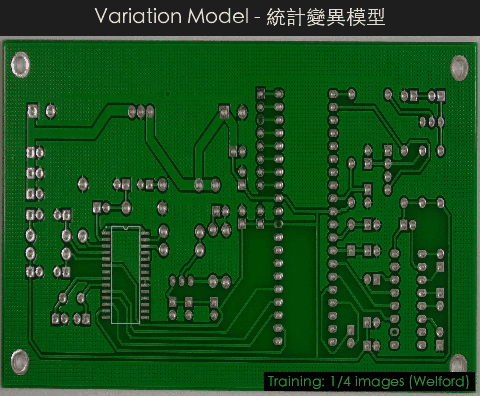
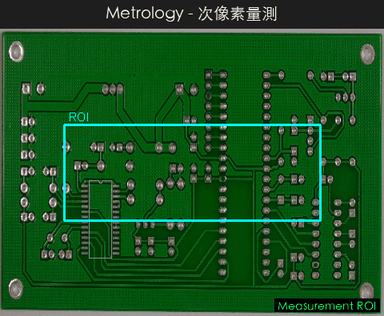
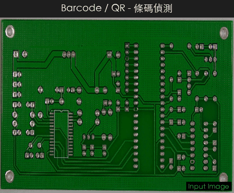
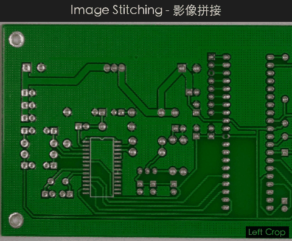

# CV Defect Detection System

<p align="center">
  <strong>整合式工業瑕疵檢測系統</strong><br>
  深度學習 (Autoencoder / PatchCore) + 統計變異模型 (Welford) + 50 種 HALCON 影像運算子<br>
  搭配 HALCON HDevelop 風格圖形化操作介面
</p>

<p align="center">
  
</p>

---

## 瑕疵檢測演算法展示

> 以 PCB（印刷電路板）瑕疵影像即時展示各檢測管線的處理過程與結果。

### 深度學習檢測

<table>
<tr>
<td align="center" width="50%">

**自編碼器異常檢測 (Autoencoder)**

卷積自編碼器重建誤差 + MSE/SSIM 混合評分


原圖 → 重建 → 誤差熱力圖 → 瑕疵疊加

</td>
<td align="center" width="50%">

**PatchCore 記憶庫檢測**

預訓練 CNN 特徵 + ball-tree kNN 異常評分


特徵提取 → 記憶庫匹配 → 異常熱力圖

</td>
</tr>
</table>

### 統計變異模型 (Variation Model) — 新整合

<p align="center">
  
</p>

Welford 線上演算法遞增計算逐像素均值/標準差 → 建立上下界閾值影像 → 即時比對偵測

| 步驟 | 說明 |
|------|------|
| 訓練 | 逐張餵入良品影像，線上更新 mean 與 M2（float64 確保數值穩定） |
| 建模 | `upper = mean + max(abs_thresh, var_thresh × std)` |
| 檢測 | 比對測試影像 → 過亮/過暗遮罩 → 形態學清理 → 連通區域擷取 |
| 多尺度 | 高斯金字塔多層偵測，同時捕捉大小範圍瑕疵 |

---

### 傳統電腦視覺方法

<table>
<tr>
<td align="center" width="50%">

**邊緣檢測 (Edge Detection)**

Canny / Sobel 梯度邊緣提取


</td>
<td align="center" width="50%">

**連通區域分析 (Blob Analysis)**

Otsu 閾值分割 + 連通元件標記


</td>
</tr>
<tr>
<td align="center">

**形態學運算 (Morphology)**

侵蝕 / 膨脹 / 開運算 / 閉運算


</td>
<td align="center">

**FFT 頻域分析 (Frequency Domain)**

頻譜視覺化 + 高斯高/低通濾波


</td>
</tr>
<tr>
<td align="center">

**色彩檢測 (Color Inspection)**

CIE Lab Delta-E 色差圖 + K-means 調色板


</td>
<td align="center">

**形狀匹配 (Shape Matching)**

梯度方向餘弦相似度 + 金字塔搜尋


</td>
</tr>
</table>

---

### 工業檢測工具

<table>
<tr>
<td align="center" width="50%">

**次像素量測 (Metrology)**

1D 量測矩形 + 次像素邊緣偵測 + 尺寸計算



</td>
<td align="center" width="50%">

**HALCON 影像運算子**

50+ 種濾波/形態學/紋理/色彩/幾何操作


</td>
</tr>
<tr>
<td align="center">

**條碼 / QR Code 偵測**

ISO 15416/15415 條碼分級 + QR/DataMatrix 解碼



</td>
<td align="center">

**影像拼接 (Stitching)**

特徵點匹配 + RANSAC 單應性 + 多圖拼接



</td>
</tr>
</table>

<details>
<summary><b>重新生成 Demo GIF</b></summary>

```bash
conda activate cv-detect
python generate_demo_gifs.py
```

GIF 輸出至 `assets/demo/`，使用 PCB Defect Dataset v3 (CC BY 4.0) 的影像。
</details>

---

## 系統架構

```
cv-detect/
├── dl_anomaly/                     # 統一檢測模組（DL + VM 整合）
│   ├── main.py                     # 應用程式進入點
│   ├── config.py                   # DL 組態（自動裝置偵測 CUDA/MPS/CPU）
│   ├── core/
│   │   ├── autoencoder.py          # CNN 自編碼器架構
│   │   ├── anomaly_scorer.py       # MSE + SSIM 異常評分
│   │   ├── variation_model.py      # ★ Welford 統計變異模型
│   │   ├── vm_inspector.py         # ★ VM 瑕疵比對器
│   │   ├── vm_preprocessor.py      # ★ VM 影像前處理（含 ECC 對齊）
│   │   ├── vm_postprocessor.py     # ★ VM 形態學後處理
│   │   ├── vm_config.py            # ★ VM 專用組態
│   │   ├── halcon_ops.py           # 50+ HALCON 影像運算子
│   │   ├── recipe.py               # 處理管線配方（JSON）
│   │   └── ...                     # 其餘共用模組 re-export
│   ├── pipeline/
│   │   ├── trainer.py              # DL 訓練管線
│   │   ├── inference.py            # DL 推論管線
│   │   ├── vm_trainer.py           # ★ VM 訓練管線
│   │   └── vm_inference.py         # ★ VM 推論管線
│   ├── gui/                        # Tkinter GUI（6 Mixin 架構）
│   │   ├── halcon_app.py           # 主視窗組裝
│   │   ├── mixins_menu.py          # 選單建構
│   │   ├── mixins_image_ops.py     # DL 影像/模型操作
│   │   ├── mixins_vm_ops.py        # ★ VM 訓練/檢測操作
│   │   ├── mixins_dialogs.py       # 對話框開啟
│   │   ├── mixins_region.py        # 區域操作
│   │   ├── mixins_halcon.py        # HALCON 運算子
│   │   └── 20+ 個 UI 面板與對話框
│   └── visualization/
│       ├── heatmap.py              # DL 誤差熱力圖
│       ├── vm_heatmap.py           # ★ VM 差異熱力圖/閾值視覺化
│       └── vm_report.py            # ★ VM 批次報告
├── shared/                         # 共用核心演算法（單一來源）
│   └── core/                       # 26 個模組、1.2 MB
│       ├── patchcore.py            # PatchCore (ball-tree + einsum)
│       ├── shape_matching.py       # 梯度方向形狀匹配
│       ├── metrology.py            # 次像素量測
│       ├── calibration.py          # 相機標定
│       ├── frequency.py            # FFT 頻域處理
│       ├── color_inspect.py        # CIE Lab 色差檢測
│       ├── stitching.py            # 影像拼接
│       ├── results_db.py           # SQLite SPC 資料庫
│       ├── report_generator.py     # PDF 報告
│       └── ...
└── tests/                          # pytest 測試套件
```

> `★` 標記為本次整合新增的 Variation Model 模組

---

## 功能總覽

| 類別 | 功能 |
|------|------|
| **DL 異常檢測** | 卷積自編碼器 (MSE+SSIM)、PatchCore (ball-tree kNN)、ONNX 匯出推論 |
| **統計變異模型** | Welford 線上統計、均值/標準差閾值、多尺度高斯金字塔、ECC/特徵對齊 |
| **影像處理** | 50+ HALCON 運算子：濾波、邊緣、形態學、色彩、紋理、頻域、幾何 |
| **閾值分割** | Otsu / 自適應 / 動態 / 可變 / 局部閾值 + Blob 分析 |
| **形狀匹配** | 梯度方向餘弦相似度、金字塔搜尋、次像素精修、NMS |
| **量測** | 次像素邊緣偵測、1D 量測矩形、直線/圓/橢圓擬合 |
| **頻域** | FFT、高斯/Butterworth/帶通/陷波濾波、週期紋理去除 |
| **色彩** | CIE Lab、CIEDE2000 Delta-E、K-means 調色板、均勻性檢測 |
| **OCR / 條碼** | Tesseract + PaddleOCR 雙引擎、ISO 15416/15415 條碼分級 |
| **工程工具** | 相機標定 (Zhang 法)、並行管線、SPC 統計 (Cp/Cpk)、影像拼接 |
| **部署** | ONNX (CUDA/CoreML/CPU)、`.cpmodel` 管線模型打包、PyInstaller |
| **GUI** | HALCON HDevelop 風格三面板介面、OK/NG 判定、即時檢測、PDF 報告 |

> 詳細架構說明請參閱 [`docs/architecture.md`](docs/architecture.md)

---

## 選單結構（整合後）

```
模型
├── DL 模型 (Autoencoder)
│   ├── 訓練新模型...              F6
│   ├── 載入 / 儲存 Checkpoint
│   ├── 模型資訊、計算閾值
│   └── 管線模型 (.cpmodel)
├── Variation Model (統計)
│   ├── 訓練新模型...
│   ├── 載入 / 儲存模型 (.npz)
│   ├── 模型資訊
│   ├── 重新計算閾值
│   └── 閾值視覺化
└── 管線模型 (Pipeline Model)
    ├── 儲存 / 載入管線模型
    └── 模型管理器

操作
├── 灰階 / 模糊 / 邊緣 / 直方圖均衡 / 反色
├── 自動編碼器 / 誤差圖 / SSIM / 閾值遮罩
├── VM 單張檢測
└── VM 批次檢測
```

---

## 環境需求

- **Python** 3.10+
- **GPU 支援**（自動偵測）：
  - NVIDIA CUDA（Linux/Windows）
  - Apple Silicon MPS（macOS M1+）
  - 無 GPU 時自動降回 CPU

### 安裝

```bash
# 建議使用 conda 環境
conda create -n cv-detect python=3.12
conda activate cv-detect

# 基本安裝
pip install -r requirements.txt

# 或使用 pyproject.toml（支援可選套件群組）
pip install -e .                    # 基本安裝
pip install -e ".[onnx]"            # + ONNX 推論
pip install -e ".[ocr,barcode]"     # + OCR + 條碼
pip install -e ".[camera]"          # + 工業相機
pip install -e ".[dev]"             # + 開發工具
```

<details>
<summary><b>主要相依套件</b></summary>

| 套件 | 用途 |
|------|------|
| torch, torchvision | 深度學習框架（自編碼器、PatchCore） |
| opencv-python | 影像讀取與處理 |
| numpy | 數值運算 |
| Pillow | 影像格式支援 |
| matplotlib | 視覺化繪圖、SPC 管制圖 |
| scipy | 科學計算（高斯濾波等） |
| scikit-image | SSIM 計算 |
| scikit-learn | NearestNeighbors（PatchCore ball-tree） |
| python-dotenv | .env 組態檔載入 |

**選用套件**

| 套件 | 用途 |
|------|------|
| onnxruntime / onnxruntime-gpu | ONNX 模型推論加速 |
| pytesseract | Tesseract OCR 文字辨識 |
| paddleocr | PaddleOCR 文字辨識 |
| pyzbar | 條碼 / QR Code 解碼 |
| harvesters | GenICam 工業相機支援 |

</details>

---

## 使用方式

### 啟動應用程式

```bash
# 統一入口（含 DL + Variation Model 功能）
python dl_anomaly/main.py
```

### GUI 操作

啟動後進入 HALCON HDevelop 風格的三面板介面：

| 面板 | 功能 |
|------|------|
| **左側** — 管線面板 | 顯示處理步驟與縮圖，支援拖曳排序 |
| **中央** — 影像檢視器 | 滾輪縮放、拖曳平移、像素值追蹤、區域選取 |
| **右側** — 屬性/操作 | 影像屬性、參數調整、OK/NG 判定、即時檢測、SPC 儀表板 |

### 快捷鍵

| 快捷鍵 | 功能 |
|--------|------|
| `Ctrl+O` / `Ctrl+S` | 開啟 / 儲存影像 |
| `Ctrl+Z` / `Ctrl+Y` | 復原 / 重做 |
| `F5` | 執行 DL 檢測 |
| `F6` | 訓練 DL 模型 |
| `Ctrl+M` | 形狀匹配 |
| `Ctrl+Shift+M` | 量測工具 |
| `Ctrl+R` | ROI 管理 |
| `Ctrl+Shift+P` | PatchCore / ONNX 模型 |
| `Ctrl+Shift+T` | 檢測工具 (FFT / 色彩 / OCR / 條碼) |
| `Ctrl+Shift+E` | 工程工具 (標定 / 管線 / SPC / 拼接) |
| `Ctrl+Shift+V` | MVP 工具 (相機 / 檢測流程 / PDF 報告) |
| `Ctrl+Shift+A` | 自動閾值校準 |
| `F8` / `F9` | 腳本編輯器 / 執行腳本 |

### 組態設定

透過 `dl_anomaly/.env` 檔案設定參數：

```env
# DL 模型參數
IMAGE_SIZE=256
GRAYSCALE=false
LATENT_DIM=128
BATCH_SIZE=16
NUM_EPOCHS=100
DEVICE=auto                    # auto | cuda | mps | cpu
ANOMALY_THRESHOLD_PERCENTILE=95
SSIM_WEIGHT=0.5
```

---

## 編譯執行檔

```bash
pip install pyinstaller

# macOS
cd dl_anomaly
pyinstaller build_mac.spec --clean --noconfirm
# → dist/DL_AnomalyDetector.app

# Windows
pyinstaller build.spec --noconfirm
# → dist\DL_AnomalyDetector\DL_AnomalyDetector.exe
```

---

## 測試

```bash
# pytest 測試套件
pytest tests/ -q

# 整合測試
python test_all_functions.py
```

| 測試模組 | 數量 | 內容 |
|---------|------|------|
| `test_config.py` | 14 (23) | 組態預設值、裝置選擇、布林解析（含參數化） |
| `test_anomaly_scorer.py` | 17 | 逐像素誤差、影像評分、閾值分類 |
| `test_preprocessor.py` | 8 | 前處理 transform、正規化反轉 |
| `test_variation_model.py` | 17 | Welford 演算法、均值/標準差、存讀 |
| `test_validation.py` | 22 (26) | 影像驗證、核大小、範圍檢查（含參數化） |
| `test_pipeline_model.py` | 30 | 路徑處理、建構/儲存/載入、註冊表 CRUD |

---

## License

Proprietary - TastyByte
