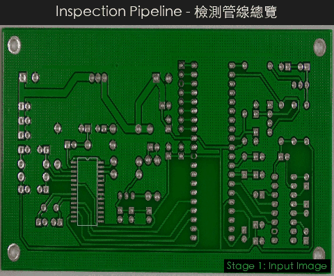
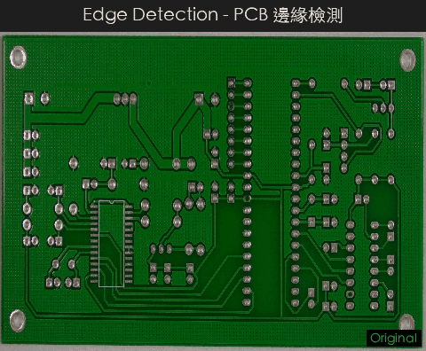
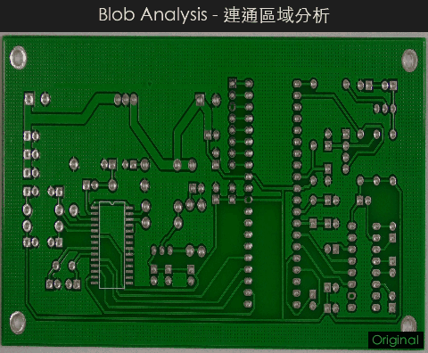
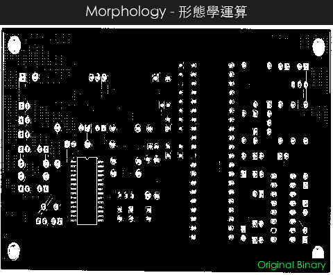
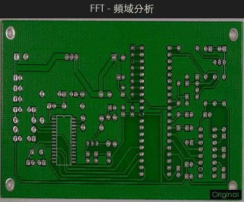
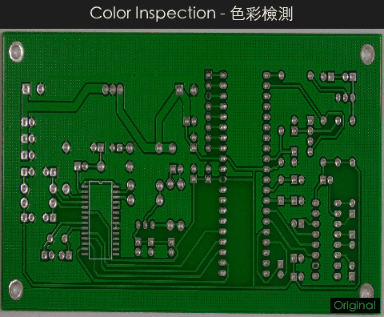
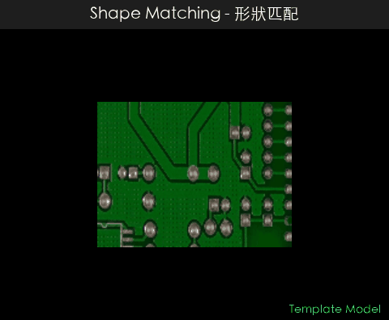
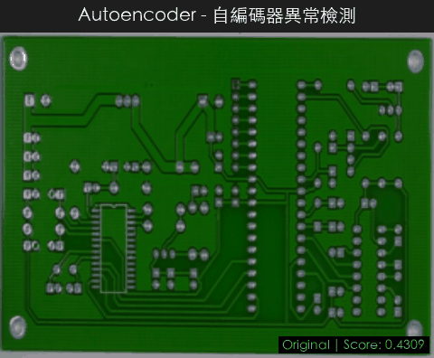
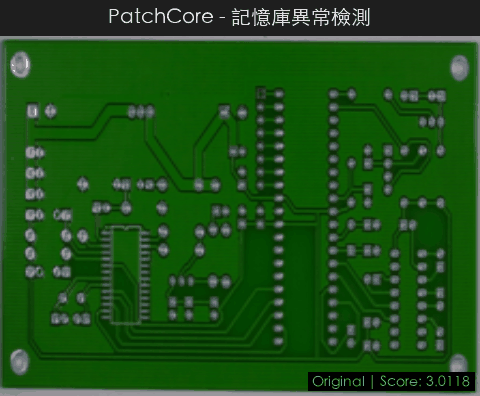

# CV Defect Detection System

基於電腦視覺的工業瑕疵檢測系統，提供兩種獨立的檢測方法，搭配 HALCON HDevelop 風格的圖形化操作介面。涵蓋從影像擷取、前處理、瑕疵偵測到統計分析的完整檢測流程。

## 瑕疵檢測演算法展示

> 以 PCB（印刷電路板）瑕疵影像即時展示各檢測管線的處理過程與結果。

### 完整檢測管線總覽

從影像輸入、前處理、邊緣偵測、分割到異常圖生成的完整流程：

<p align="center">
  
</p>

---

### 傳統電腦視覺方法

<table>
<tr>
<td align="center" width="50%">

**邊緣檢測 (Edge Detection)**

Canny / Sobel 梯度邊緣提取



</td>
<td align="center" width="50%">

**連通區域分析 (Blob Analysis)**

Otsu 閾值分割 + 連通元件標記



</td>
</tr>
<tr>
<td align="center">

**形態學運算 (Morphology)**

侵蝕 / 膨脹 / 開運算 / 閉運算



</td>
<td align="center">

**FFT 頻域分析 (Frequency Domain)**

頻譜視覺化 + 高斯高/低通濾波



</td>
</tr>
<tr>
<td align="center">

**色彩檢測 (Color Inspection)**

CIE Lab Delta-E 色差圖 + K-means 調色板



</td>
<td align="center">

**形狀匹配 (Shape Matching)**

梯度方向餘弦相似度 + 金字塔搜尋



</td>
</tr>
</table>

### 深度學習方法

<table>
<tr>
<td align="center" width="50%">

**自編碼器異常檢測 (Autoencoder)**

卷積自編碼器重建誤差 + MSE/SSIM 混合評分



</td>
<td align="center" width="50%">

**PatchCore 記憶庫檢測**

預訓練 CNN 特徵 + ball-tree kNN 異常評分



</td>
</tr>
</table>

<details>
<summary><b>重新生成 Demo GIF</b></summary>

```bash
conda activate cv-detect
python generate_demo_gifs.py
```

GIF 輸出至 `assets/demo/`，使用 PCB Defect Dataset v3 (CC BY 4.0) 的影像。
</details>

---

## 功能總覽

### 核心檢測引擎

| 引擎 | 演算法 | 適用場景 |
|------|--------|---------|
| **DL Anomaly Detector** | 卷積自編碼器 + PatchCore | 外觀瑕疵、未知缺陷類型 |
| **Variation Model Inspector** | Welford 線上統計 | 固定產品、穩定光源 |

### Phase 1 — 形狀匹配 / 量測 / ROI

| 模組 | 功能 | 核心檔案 |
|------|------|---------|
| 形狀匹配 | 梯度方向餘弦相似度、金字塔搜尋、次像素精修、NMS | `shared/core/shape_matching.py` |
| 量測工具 | 次像素邊緣偵測、1D 量測矩形、直線/圓/橢圓擬合 (Tukey/Huber/Fitzgibbon) | `shared/core/metrology.py` |
| ROI 管理 | 6 種 ROI 類型、遮罩生成、JSON 持久化 | `core/roi_manager.py` |

### Phase 2 — PatchCore / ONNX

| 模組 | 功能 | 核心檔案 |
|------|------|---------|
| PatchCore | 預訓練骨幹特徵萃取、貪婪最遠點核心集（einsum 優化）、ball-tree kNN 異常評分 | `shared/core/patchcore.py` |
| ONNX 推論 | PyTorch→ONNX 匯出、自動 Provider 選擇 (CUDA/CoreML/CPU)、模型元資料 | `shared/core/onnx_engine.py` |

### Phase 3 — 頻域 / 色彩 / OCR / 條碼

| 模組 | 功能 | 核心檔案 |
|------|------|---------|
| FFT 頻域 | 高斯/Butterworth/帶通/帶阻/陷波濾波、週期紋理去除 | `shared/core/frequency.py` |
| 色彩檢測 | CIE Lab、CIEDE2000 ΔE、K-means 調色板、色彩一致性 | `shared/core/color_inspect.py` |
| OCR | 雙引擎 (Tesseract + PaddleOCR)、自適應前處理、Hough 校正 | `shared/core/ocr_engine.py` |
| 條碼品質 | 簡化 ISO 15416/15415 分級 (A–F)、掃描剖面、pyzbar + OpenCV | `shared/core/barcode_engine.py` |

### Phase 4 — 標定 / 管線 / SPC / 拼接

| 模組 | 功能 | 核心檔案 |
|------|------|---------|
| 座標標定 | 棋盤格/圓形網格標定、像素→mm 映射、去畸變、距離/面積量測 | `shared/core/calibration.py` |
| 並行管線 | 3 階段 ThreadPool 管線、批次處理、效能基準測試 | `shared/core/parallel_pipeline.py` |
| SPC 統計 | SQLite 結果資料庫、Cp/Cpk/Pp/Ppk、Western Electric 規則、管制圖 | `shared/core/results_db.py` |
| 影像拼接 | 全景/條帶/網格模式、ORB/SIFT/AKAZE 特徵、多頻帶混合 | `shared/core/stitching.py` |

### Phase 5 — 管線模型

| 模組 | 功能 | 核心檔案 |
|------|------|---------|
| 管線模型 | 將完整檢測管線打包為 `.cpmodel` ZIP 檔、嵌入模型/模板/標定檔、可攜式部署 | `shared/core/pipeline_model.py` |
| 模型註冊表 | 掃描/搜尋/載入/刪除 `.cpmodel` 檔案管理 | `shared/core/pipeline_model.py` |
| 管線模型 GUI | 儲存/載入/管理 `.cpmodel` 對話框 | `dl_anomaly/gui/pipeline_model_dialog.py` |

### MVP 功能

| 模組 | 功能 | 核心檔案 |
|------|------|---------|
| 工業相機 | GenICam/GigE Vision 串流、曝光/增益控制 | `shared/core/camera.py` |
| 檢測流程 | 鏈式管線編排（定位→偵測→量測→分類→判定） | `core/inspection_flow.py` |
| PDF 報告 | 多頁檢測報告匯出、SPC 統計圖表 | `shared/core/report_generator.py` |

## 專案結構

```
cv-detect/
├── dl_anomaly/                  # 深度學習異常檢測模組
│   ├── main.py                  # 應用程式進入點（含 splash screen）
│   ├── config.py                # 組態管理（自動裝置偵測：CUDA/MPS/CPU）
│   ├── core/                    # 核心演算法
│   │   ├── autoencoder.py       #   卷積自編碼器架構
│   │   ├── anomaly_scorer.py    #   異常評分（MSE + SSIM，dtype 優化）
│   │   ├── dataset.py           #   PyTorch Dataset
│   │   ├── preprocessor.py      #   影像前處理與增強
│   │   ├── halcon_ops.py        #   HALCON 影像操作（16 類別）
│   │   ├── region_ops.py        #   區域操作
│   │   ├── recipe.py            #   處理管線配方（JSON 持久化）
│   │   ├── roi_manager.py       #   ROI 管理（Phase 1）
│   │   ├── inspection_flow.py   #   檢測流程編排（AST 安全驗證）
│   │   └── *.py                 #   其餘為 shared/core/ 的 re-export
│   ├── pipeline/                # 管線編排
│   │   ├── trainer.py           #   訓練管線（GPU batch SSIM、無竟態條件）
│   │   └── inference.py         #   推論管線（自動 MPS/CUDA/CPU）
│   ├── gui/                     # Tkinter GUI（Mixin 架構）
│   │   ├── halcon_app.py        #   主視窗（645 行，含 5 個 mixin）
│   │   ├── mixins_menu.py       #   選單建構 mixin
│   │   ├── mixins_image_ops.py  #   影像操作 mixin
│   │   ├── mixins_dialogs.py    #   對話框 mixin
│   │   ├── mixins_region.py     #   區域操作 mixin
│   │   ├── mixins_halcon.py     #   HALCON 運算子 mixin
│   │   ├── image_viewer.py      #   影像檢視器（縮放、平移、像素追蹤）
│   │   ├── pipeline_panel.py    #   管線面板（步驟縮圖）
│   │   ├── toolbar.py           #   工具列
│   │   ├── operations_panel.py  #   操作面板
│   │   ├── properties_panel.py  #   屬性面板
│   │   ├── pixel_inspector.py   #   像素值檢測器
│   │   ├── train_tab.py         #   訓練分頁
│   │   ├── inspect_tab.py       #   檢測分頁
│   │   ├── settings_tab.py      #   設定分頁
│   │   ├── shape_matching_dialog.py    # 形狀匹配對話框
│   │   ├── metrology_dialog.py         # 量測工具對話框
│   │   ├── roi_dialog.py               # ROI 管理對話框
│   │   ├── advanced_models_dialog.py   # PatchCore/ONNX 對話框
│   │   ├── inspection_tools_dialog.py  # 檢測工具（FFT/色彩/OCR/條碼）
│   │   ├── engineering_tools_dialog.py # 工程工具（標定/管線/SPC/拼接）
│   │   ├── mvp_tools_dialog.py  #   MVP 工具（相機/流程/報告）
│   │   ├── blob_analysis.py     #   Blob 分析
│   │   ├── region_filter_dialog.py #  區域篩選對話框
│   │   ├── threshold_dialog.py  #   閾值調整對話框
│   │   ├── compare_dialog.py    #   影像比對對話框
│   │   ├── batch_compare_dialog.py #  批次比對對話框
│   │   ├── recipe_apply_dialog.py  #  配方套用對話框
│   │   ├── pipeline_model_dialog.py # 管線模型儲存/載入/管理對話框
│   │   ├── script_editor.py     #   腳本編輯器
│   │   └── dialogs.py           #   通用對話框集合
│   └── visualization/           # 視覺化
│       ├── heatmap.py           #   誤差熱力圖、瑕疵疊加（遮罩優化）
│       ├── report.py            #   統計報告
│       └── training_plots.py    #   訓練曲線（繁體中文）
│
├── variation_model/             # 統計變異模型模組
│   ├── main.py                  # 進入點（含 splash screen）
│   ├── config.py                # 組態管理
│   ├── core/                    # 核心演算法
│   │   ├── variation_model.py   #   Welford 線上統計（std 快取優化）
│   │   ├── inspector.py         #   瑕疵比對（無複製優化）
│   │   ├── preprocessor.py      #   影像前處理與對齊
│   │   ├── postprocessor.py     #   形態學後處理
│   │   ├── halcon_ops.py        #   HALCON 影像操作
│   │   ├── region_ops.py        #   區域操作
│   │   └── *.py                 #   其餘為 shared/core/ 的 re-export
│   ├── pipeline/                # 管線編排
│   ├── gui/                     # Tkinter GUI（繁體中文介面）
│   │   ├── halcon_app.py        #   主視窗
│   │   ├── image_viewer.py      #   影像檢視器
│   │   ├── pipeline_panel.py    #   管線面板
│   │   ├── toolbar.py           #   工具列
│   │   ├── shape_matching_dialog.py    # 形狀匹配對話框
│   │   ├── metrology_dialog.py         # 量測工具對話框
│   │   ├── roi_dialog.py               # ROI 管理對話框
│   │   ├── advanced_models_dialog.py   # PatchCore/ONNX 對話框
│   │   ├── inspection_tools_dialog.py  # 檢測工具
│   │   ├── engineering_tools_dialog.py # 工程工具
│   │   ├── mvp_tools_dialog.py  #   MVP 工具
│   │   └── ...                  #   其餘面板與對話框
│   └── visualization/           # 視覺化
│
├── shared/                      # 共用模組（單一真實來源）
│   ├── core/                    # 整合 Phase 1–5 核心演算法（16 檔案）
│   │   ├── patchcore.py         #   PatchCore（ball-tree + einsum）
│   │   ├── onnx_engine.py       #   ONNX 推論（CUDA/CoreML/CPU）
│   │   ├── camera.py            #   工業相機介面
│   │   ├── report_generator.py  #   PDF 報告生成
│   │   ├── results_db.py        #   SPC 資料庫（SQL 注入防護）
│   │   ├── calibration.py       #   相機標定
│   │   ├── metrology.py         #   次像素量測
│   │   ├── shape_matching.py    #   形狀匹配
│   │   ├── parallel_pipeline.py #   並行管線
│   │   ├── stitching.py         #   影像拼接
│   │   ├── frequency.py         #   FFT 頻域處理
│   │   ├── color_inspect.py     #   色彩檢測
│   │   ├── ocr_engine.py        #   OCR 引擎
│   │   ├── barcode_engine.py    #   條碼引擎
│   │   ├── pipeline_model.py    #   管線模型打包與註冊表
│   │   └── region.py            #   區域資料結構
│   ├── app_state.py             # 應用程式狀態持久化
│   ├── progress_manager.py      # 進度條管理
│   ├── error_dialog.py          # 錯誤對話框（錯誤碼 + 修復建議）
│   ├── history_panel.py         # 復原/重做歷史面板
│   ├── op_logger.py             # 操作計時日誌
│   └── validation.py            # 影像輸入驗證
│
├── tests/                       # pytest 測試套件
│   ├── conftest.py              # 共用 fixtures（合成影像、暫存目錄）
│   ├── test_dl_anomaly/         # DL 模組測試
│   │   ├── test_config.py       #   組態與裝置選擇（14 函式）
│   │   ├── test_anomaly_scorer.py #  異常評分（17 函式）
│   │   ├── test_preprocessor.py #   前處理（8 函式）
│   │   └── test_variation_model.py # Welford 演算法（17 函式）
│   └── test_shared/             # 共用模組測試
│       ├── test_validation.py   #   輸入驗證（22 函式）
│       └── test_pipeline_model.py # 管線模型（30 函式）
│
├── docs/                        # 文件與教學
│   ├── CV_Defect_Detection_Tutorial.pdf  # 教學手冊（PDF）
│   ├── generate_cv_tutorial.py  #   教學 PDF 生成腳本
│   ├── _ch1_6.py                #   第 1–6 章內容
│   ├── _ch7_13.py               #   第 7–13 章內容
│   ├── _ch15_19.py              #   第 15–19 章內容
│   └── _ch20_25.py              #   第 20–25 章內容
├── pyproject.toml               # 專案定義與相依管理
├── requirements.txt             # pip 相依套件
└── test_all_functions.py        # 整合測試套件（1,489 行）
```

## 環境需求

- **Python** 3.10+
- **GPU 支援**（自動偵測）：
  - NVIDIA CUDA（Linux/Windows）
  - Apple Silicon MPS（macOS M1+）
  - 無 GPU 時自動降回 CPU

### 安裝相依套件

```bash
# 建議使用 conda 環境
conda create -n cv-detect python=3.12
conda activate cv-detect

# 基本安裝
pip install -r requirements.txt

# 或使用 pyproject.toml（支援可選套件群組）
pip install -e .                    # 基本安裝
pip install -e ".[onnx]"            # + ONNX 推論
pip install -e ".[ocr,barcode]"     # + OCR + 條碼
pip install -e ".[camera]"          # + 工業相機
pip install -e ".[dev]"             # + 開發工具（pytest, ruff, pyinstaller）
```

主要相依套件：

| 套件 | 用途 |
|------|------|
| torch, torchvision | 深度學習框架（自編碼器、PatchCore） |
| opencv-python | 影像讀取與處理 |
| numpy | 數值運算 |
| Pillow | 影像格式支援 |
| matplotlib | 視覺化繪圖、SPC 管制圖 |
| scipy | 科學計算（高斯濾波等） |
| scikit-image | SSIM 計算 |
| scikit-learn | NearestNeighbors（PatchCore ball-tree） |
| python-dotenv | .env 組態檔載入 |

選用相依套件：

| 套件 | 用途 |
|------|------|
| onnxruntime / onnxruntime-gpu | ONNX 模型推論加速 |
| pytesseract | Tesseract OCR 文字辨識 |
| paddleocr | PaddleOCR 文字辨識 |
| pyzbar | 條碼 / QR Code 解碼 |
| harvesters | GenICam 工業相機支援 |

## 使用方式

### 以 Python 直接執行

```bash
# DL Anomaly Detector
python dl_anomaly/main.py

# Variation Model Inspector
python variation_model/main.py
```

### GUI 操作

啟動後先顯示 splash screen，接著進入 HALCON HDevelop 風格的三面板介面：

- **左側**：管線面板 — 顯示處理步驟與縮圖
- **中央**：影像檢視器 — 支援滾輪縮放、拖曳平移、像素值追蹤
- **右側**：屬性面板 + 操作面板

**工具選單**提供所有進階功能：

| 快捷鍵 | 功能 |
|--------|------|
| `Ctrl+M` | 形狀匹配 |
| `Ctrl+Shift+M` | 量測工具 |
| `Ctrl+R` | ROI 管理 |
| `Ctrl+Shift+P` | PatchCore / ONNX 模型 |
| `Ctrl+Shift+T` | 檢測工具 (FFT / 色彩 / OCR / 條碼) |
| `Ctrl+Shift+E` | 工程工具 (標定 / 管線 / SPC / 拼接) |
| `Ctrl+Shift+V` | MVP 工具 (相機 / 檢測流程 / PDF 報告) |

### 組態設定

透過各模組目錄下的 `.env` 檔案設定參數：

```env
# dl_anomaly/.env 範例
IMAGE_SIZE=256
GRAYSCALE=false
LATENT_DIM=128
BASE_CHANNELS=32
NUM_ENCODER_BLOCKS=4
BATCH_SIZE=16
LEARNING_RATE=0.001
NUM_EPOCHS=100
EARLY_STOPPING_PATIENCE=10
DEVICE=auto                    # auto | cuda | mps | cpu
ANOMALY_THRESHOLD_PERCENTILE=95
SSIM_WEIGHT=0.5
CHECKPOINT_DIR=./checkpoints
RESULTS_DIR=./results
```

## 編譯執行檔

使用 [PyInstaller](https://pyinstaller.org/) 將應用程式打包為獨立執行檔。

### 前置準備

```bash
pip install pyinstaller
```

### macOS

```bash
# DL Anomaly Detector
cd dl_anomaly
pyinstaller build_mac.spec --clean --noconfirm

# Variation Model Inspector
cd variation_model
pyinstaller build_mac.spec --clean --noconfirm
```

> **注意**：兩個專案須依序編譯（不可平行），以避免 PyInstaller bincache 衝突。

產出路徑：
- `dl_anomaly/dist/DL_AnomalyDetector.app`
- `variation_model/dist/VariationModelInspector.app`

### Windows

```bash
cd dl_anomaly
pyinstaller build.spec --noconfirm
```

產出路徑：
- `dl_anomaly\dist\DL_AnomalyDetector\DL_AnomalyDetector.exe`
- `variation_model\dist\VariationModelInspector\VariationModelInspector.exe`

## 測試

```bash
# pytest 測試套件（108 函式 / 121 test cases，含參數化測試）
pytest tests/ -q

# 整合測試
python test_all_functions.py
```

pytest 測試涵蓋：

| 測試模組 | 數量 | 內容 |
|---------|------|------|
| `test_config.py` | 14 (23) | 組態預設值、裝置選擇、布林解析（含參數化） |
| `test_anomaly_scorer.py` | 17 | 逐像素誤差、影像評分、閾值分類 |
| `test_preprocessor.py` | 8 | 前處理 transform、正規化反轉 |
| `test_variation_model.py` | 17 | Welford 演算法、均值/標準差、存讀 |
| `test_validation.py` | 22 (26) | 影像驗證、核大小、範圍檢查（含參數化） |
| `test_pipeline_model.py` | 30 | 路徑處理、建構/儲存/載入、註冊表 CRUD |

## 技術架構

### 自編碼器架構（DL Anomaly）

```
Input → [ConvBlock + MaxPool] × N → AdaptiveAvgPool(4) → Linear(latent_dim)
                                                              ↓
Output ← [Upsample + ConvBlock] × N ← Linear ← Linear(latent_dim)
```

- 殘差捷徑（Residual Shortcuts）
- BatchNorm + LeakyReLU(0.2)
- 可配置：`latent_dim`、`base_channels`、`num_encoder_blocks`

### PatchCore 架構

```
Input → Pre-trained Backbone (ResNet/EfficientNet) → Multi-layer Feature Maps
    → Patch Embedding → Greedy Farthest-Point Coreset (einsum 優化)
    → Memory Bank → Ball-tree NearestNeighbors → Anomaly Map + Score
```

### 變異模型架構（Variation Model）

```
良品影像 × N → Welford 線上統計 → per-pixel 均值 + 標準差
    → 動態閾值 (mean ± k×std) → 逐像素比對 → 差異圖 + 瑕疵遮罩
```

### GPU 裝置自動偵測

```python
# 三層裝置偵測（config.py）
auto → CUDA (NVIDIA) → MPS (Apple Silicon M1+) → CPU
```

支援的推論加速：

| 框架 | NVIDIA GPU | Apple Silicon | CPU |
|------|-----------|--------------|-----|
| PyTorch | CUDAExecutionProvider | MPS backend | CPU |
| ONNX Runtime | CUDAExecutionProvider | CoreMLExecutionProvider | CPUExecutionProvider |

### 訓練流程

1. 載入良品影像 → 建立 `DefectFreeDataset`（安全 transform，無竟態條件）
2. MSE + SSIM 混合損失函數（GPU batch 計算，無 CPU 來回轉換）
3. AdamW 優化器 + CosineAnnealingLR 學習率排程
4. 早停機制（patience-based）+ Checkpoint 儲存（`weights_only=True` 安全載入）
5. 訓練完成後自動擬合異常閾值（快取特徵，無重複 backbone forward）

### 推論流程

1. 載入 Checkpoint → 前處理輸入影像
2. 自編碼器重建 → 計算逐像素誤差圖（MSE + SSIM）
3. 計算影像級異常分數 → 與閾值比較 → 判定良品/瑕疵
4. 輸出：`InspectionResult`（原圖、重建圖、誤差圖、瑕疵遮罩、分數）

### 檢測流程管線

```
定位 (LocateStep) → 偵測 (DetectStep) → 量測 (MeasureStep)
    → 分類 (ClassifyStep) → 判定 (JudgeStep)
```

- 每個步驟可獨立配置
- 自訂步驟使用 AST 安全驗證（禁止 import、dunder 存取、危險 builtins）
- 支援 JSON 配方匯入/匯出

### SPC 統計流程

1. 檢測結果自動寫入 SQLite 資料庫（SQL 注入防護：欄位白名單）
2. 計算 X-bar 管制圖（UCL/LCL = ±3σ）
3. 計算製程能力指標（Cp/Cpk/Pp/Ppk）
4. Western Electric 規則自動偵測異常點
5. 匯出 CSV/JSON 報表 + PDF 多頁報告

## 安全性

本系統已通過安全審查並實施以下防護措施：

| 類別 | 措施 |
|------|------|
| 模型載入 | `torch.load(weights_only=True)` + `np.load(allow_pickle=False)` |
| 自訂程式碼 | AST 安全驗證（禁止 import/exec/eval/dunder） |
| 資料庫 | SQL 欄位名稱白名單驗證 |
| 配方系統 | JSON schema 驗證、受限 builtins |

## 程式碼架構

### Mixin 架構（DL Anomaly GUI）

`HalconApp` 主視窗拆分為 5 個 mixin，降低單檔複雜度：

| Mixin | 職責 | 行數 |
|-------|------|------|
| `MenuMixin` | 選單列建構 | 286 |
| `ImageOpsMixin` | 影像 I/O、模型操作、DL 操作 | 878 |
| `DialogMixin` | 所有對話框開啟 | 506 |
| `RegionMixin` | 區域/形態學操作 | 659 |
| `HalconOpsMixin` | HALCON 運算子與濾波器 | 621 |
| `HalconApp`（主檔） | 初始化、佈局、事件綁定 | 645 |

### 共用核心模組

16 個跨模組共用的演算法檔案整合至 `shared/core/`，兩個應用模組透過 re-export wrapper 引用，確保單一真實來源（Single Source of Truth）。

## License

Proprietary - TastyByte
